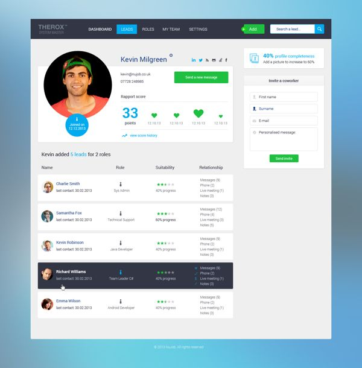
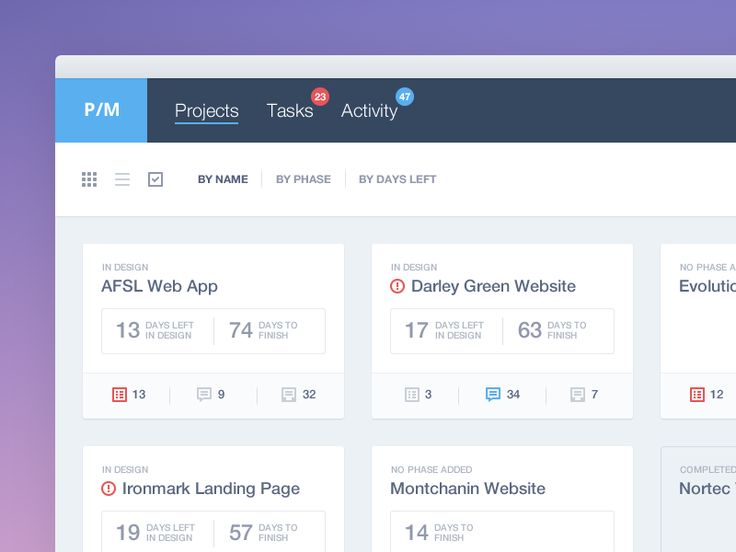

# Table of contents

* [About What's Happening](#about-what's-happening)
  * [UH Manoa Community Problem](#uh-manoa-community-problem)
  * [The What's Happening Solution](#the-what's-happening-solution)
* [Installation](#installation)
* [Development History](#development-history)
  * [Milestone 1: Mock-up Development](#milestone-1-mock-up-development)

## About What's Happening

##### UH Manoa Community Problem

_There isn’t a consolidated place where all events on campus can be posted and viewed easily. Event postings are scattered across different media._

##### The What's Happening Solution

An application where students can both post and view events that are scheduled or happening on campus. 

Upon arrival to the site, you are created by the landing page below. 


From here, the user has the option of logging in with their UH ID or continuing as a guest. The image below is what we plan to design.


Both the logged-in and non-logged in users proceed to the homepage. Below is what we plan to model.



Logged-in users have the option of listing an event, saving an event, sharing an event, or filtering the events themselves. Non-logged-in users only have the option of filtering and sharing events. Below is what we plan to model for listing an event.


You can view your saved events (what we plan to model is below):



Edit a listing that you have previously made (what we plan to model is below):


## Installation

First, [install Meteor](https://www.meteor.com/install).

Second, clone our repository [here](https://github.com/meteor-mayhem/whats-happening).

Third, cd into the app/ directory and install libraries with:

```
meteor npm install
```

Fourth, run the system with:

```
meteor npm run start
```

Last but not least, visit the application at [http://localhost:3000](http://localhost:3000). If you have an account of the UH test CAS server, you can login.

## Development History

The development process for What's Happening conformed to [Issue Driven Project Management](http://courses.ics.hawaii.edu/ics314f16/modules/project-management/) practices. Our project is broken into _Milestones_. Each Milestone consists of _issues_ which correspond to 2-3 day tasks. 

##### Milestone 1: Mock-up Development

This milestone started on April 5, 2017 and will end on April 13, 2017.

The goal of Milestone 1 is to create a working landing page and several HTML pages to provide a mock-up of the pages in the system. This mock-up is being created as a Meteor app, meaning that each page exists as a template and FlowRouter handles the routing to pages.

Mock-ups for the pages below "were" implemented during M1:

(insert screenshots of our mockups here)

Milestone 1 was implemented as [What's Happening GitHub Milestone M1](https://github.com/meteor-mayhem/whats-happening/milestone/1).

(insert finished GitHub picture of Milestone here)

Milestone 1 consists of three issues, and our progress is managed with the [What's Happening GitHub Project M1](https://github.com/meteor-mayhem/whats-happening/projects/1)

(inserted finished GitHub picture of Project M1 here)

Each issue will be implemented as its own branch, and merged into master when finished.

