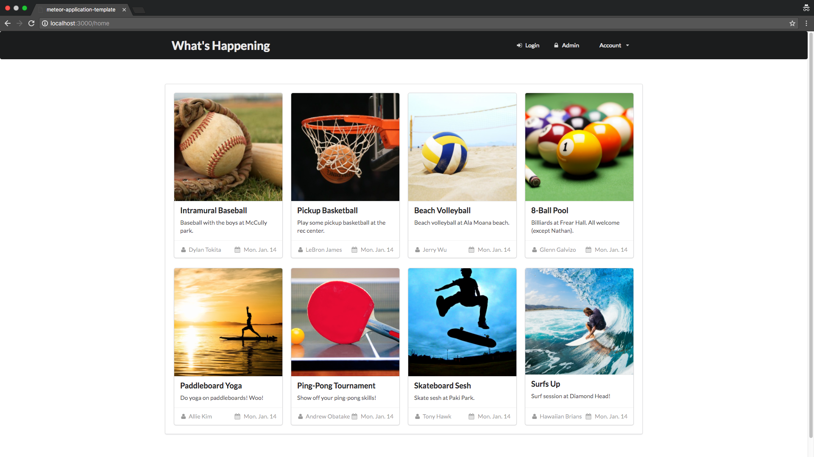
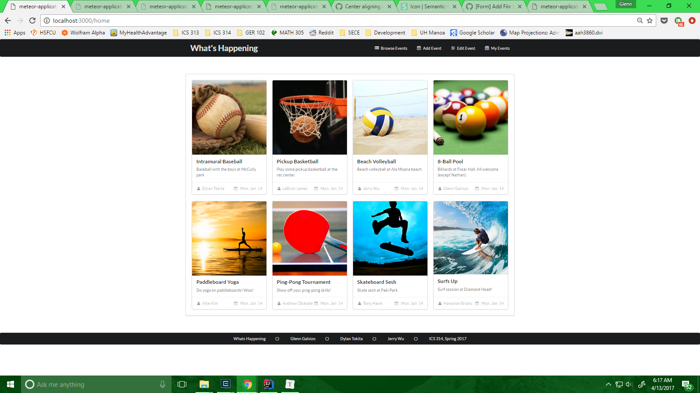

# What's Happening

## Table of contents

* [About What's Happening](#about-what's-happening)
  * [UH Manoa Community Problem](#uh-manoa-community-problem)
  * [The What's Happening Solution](#the-what's-happening-solution)
* [Installation](#installation)
* [Development History](#development-history)
  * [Milestone 1: Mock-up Development](#milestone-1-mock-up-development)
  * [Milestone 2: Basic Functionality](#milestone-2-basic-functionality)

## About What's Happening

##### UH Manoa Community Problem

There isn’t a consolidated place where all events on campus can be posted and viewed easily. Event postings are scattered across different media. As a result, promoters have to work hard to get the word out, and consumers have to work hard to search for these events.

Here's an example:


Try finding the flyer for the film festival. It's not very obvious, is it?

##### The What's Happening Solution

An application where students can both post and view events that are scheduled or happening on campus.

Upon arrival to the site, you are created by the landing page below.


Upon clicking `Find Out What's Happening`, you proceed to the homepage. 



You are currently not logged in, and are only able to view the listings. To login, you click the `Account` item in the menu bar.


You now have the option of listing an event, saving an event to their profile, sharing an event, or filtering the events themselves. The difference is shown in the menu bar.



To add an event, you click `Add Event` in the menu bar.


To edit a listing you posted earlier, click `Edit Events` to take you to a list of your events (not yet made) or edit the event in your `My Events` page.


You can view your saved events by clicking `My Events`.


## Installation

First, [install Meteor](https://www.meteor.com/install).

Second, clone our repository [here](https://github.com/meteor-mayhem/whats-happening).

Third, cd into the app/ directory and install libraries with:

```
meteor npm install
```

Fourth, run the system with:

```
meteor npm run start
```

Last but not least, visit the application at [http://localhost:3000](http://localhost:3000). If you have an account of the UH test CAS server, you can login.

## Development History

The development process for What's Happening conformed to [Issue Driven Project Management](http://courses.ics.hawaii.edu/ics314f16/modules/project-management/) practices. Our project is broken into _Milestones_. Each Milestone consists of _issues_ which correspond to 2-3 day tasks.

##### Milestone 1: Mock-up Development

This milestone started on April 5, 2017 and ended on April 13, 2017.

The goal of Milestone 1 was to create a working landing page and several HTML pages to provide a mock-up of the pages in the system. The mock-up was created as a Meteor app, meaning that each page existed as a template and FlowRouter handled the routing to pages.

Mock-ups for the pages below were implemented during M1:


Milestone 1 was implemented as [What's Happening GitHub Milestone M1](https://github.com/meteor-mayhem/whats-happening-uhm/milestone/1).

(insert finished GitHub picture of Milestone here)

Milestone 1 consists of six issues, and our progress was managed with the [What's Happening GitHub Project M1](https://github.com/whats-happening-uhm/projects/1)

(inserted finished GitHub picture of Project M1 here)

Each issue was implemented as its own branch, and merged into master when finished.

##### Milestone 2: Basic Functionality

##### This milestone started on April 13, 2017 and will end on April 25, 2017.

The goal of Milestone 2 was to...

The following pages will be given functionality:

(insert m)

Milestone 2 is being implemented as [What's Happening GitHub Milestone M2](https://github.com/whats-happening-uhm/whats-happening-uhm/milestone/2).

(insert finished GitHub picture of Milestone 2 here)

Milestone 2 consists of several issues, and our progress is managed with the [What's Happening GitHub Project M2](https://github.com/whats-happening-uhm/whats-happening-uhm/projects/1)

(inserted finished GitHub picture of Project M2 here)

Each issue was implemented as its own branch, and merged into master when finished.